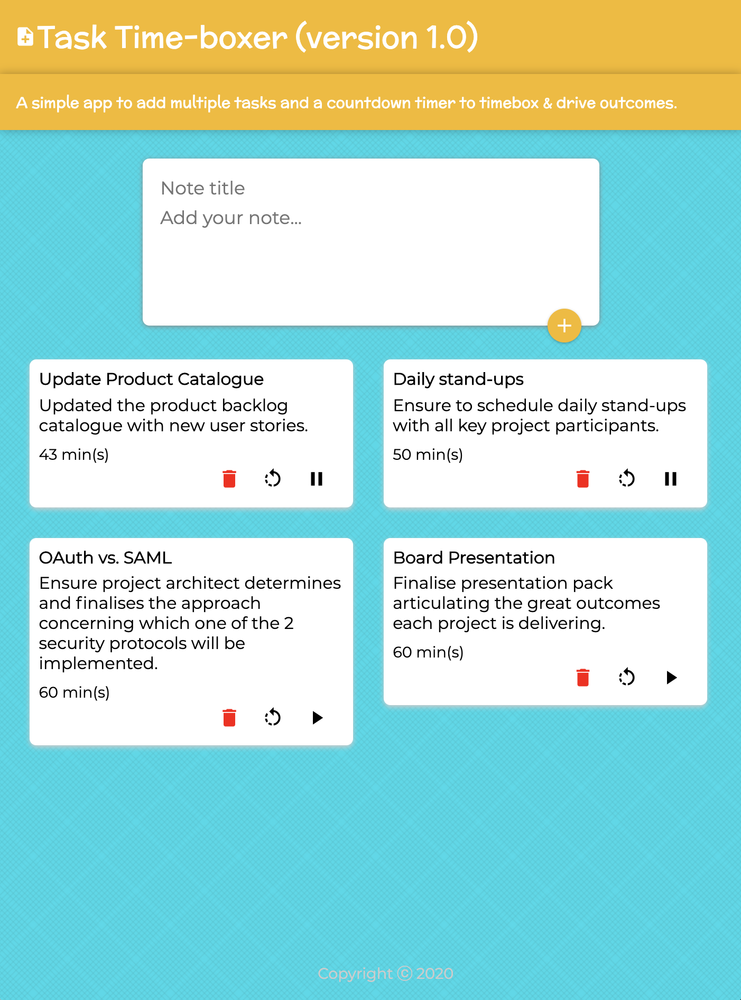

## Table of contents

-   [General info](#general-info)
-   [Link](#task-time-boxer-link)
-   [MVP](#MVP)
-   [Future functionality](#future-functionality)
-   [Screenshots](#screenshots)
-   [In-depth Features of Task Time Boxer](#in-depth-features-of-task-time-boxer)
-   [Challenges](#challenges)
-   [Technologies Used](#technologies-used)
-   [Download](#download)

## General info

This application is to enable the user to add/delete notes and commence a countdown timer to help time-box the outcome.

From a developer's point of view, it was to further explore and understand how to implement a React app with the use of hooks (i.e. setState / useEffect) with an interval countdown timer.

## Task Time Boxer Link

-   The link to the Task Time-boxer link is:
    [https://mistergjones.github.io/taskTimeBoxer/]

## MVP

The following were the key requirements in meeting the MVP/POC.

-   a user can add a number of notes / tasks they would like to keep track of.
-   a user can delete a note at any time.
-   a user can commence 60 minute countdown timer on the task of interest.
-   a user can PAUSE and RESET the countdown timer if need be.

## Future Functionality

Future functionality can incorporate the following:

-   Either implement session persistence to allow saving or implement a database feature.
-   Augment the application to mimick a Kanban board and allow the user drag/drop each note to headings such as: "Backlog", "In-progress" and "Done".
-   A user can define a custom countdown timer duration.

## Screenshots

## In-depth Features of Task Time Boxer

-   the use of hooks (setState / useEffect).
-   setInterval and clearInterval functionality.
-   in-line styling of buttons.
-   incorporating the use of MaterialUI.

## Challenges

-   Utilising the use of setInterval and clearInterval. i.e. understanding how React implements hooks with setState() and UseEffect().

## Technologies Used

Project is created with:

-   React JS.
-   MaterialUI (React's UI framework).
-   CSS.
-   HTML.
-   Git/Github (for version control).

## Download

Download via:

-   https://github.com/mistergjones/taskTimeBoxer.git
